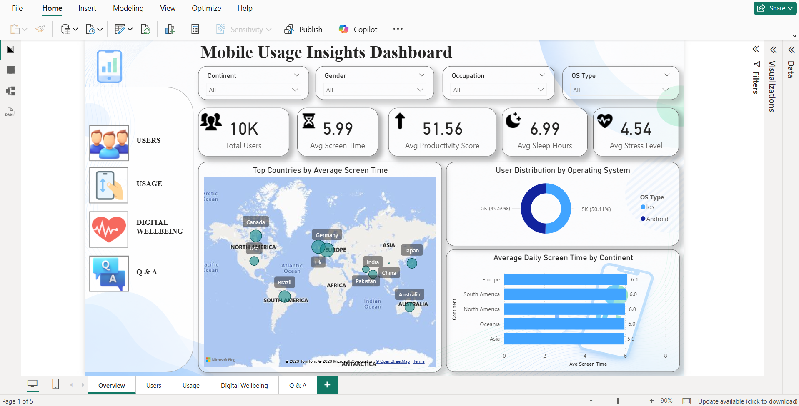
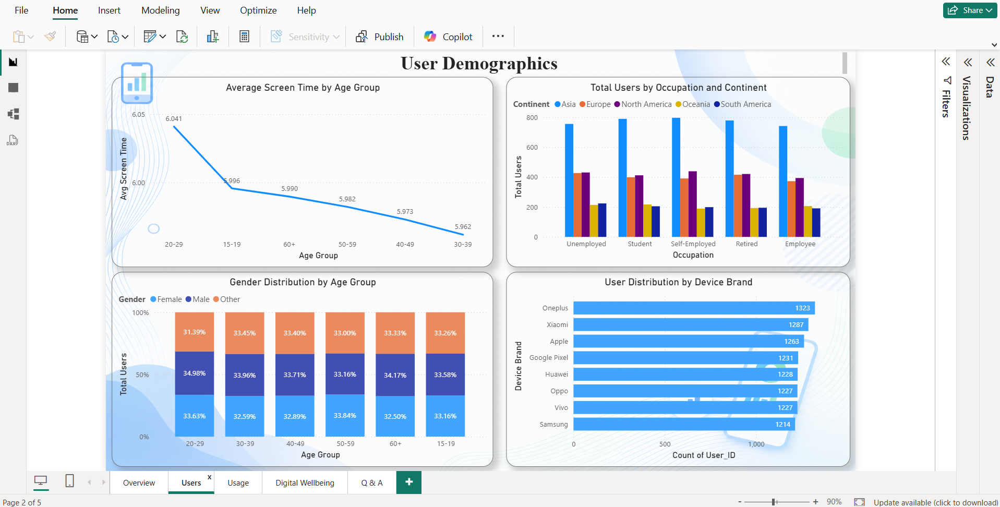
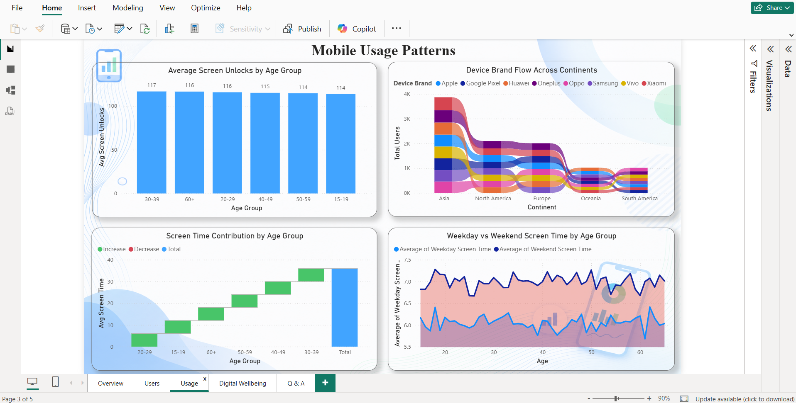
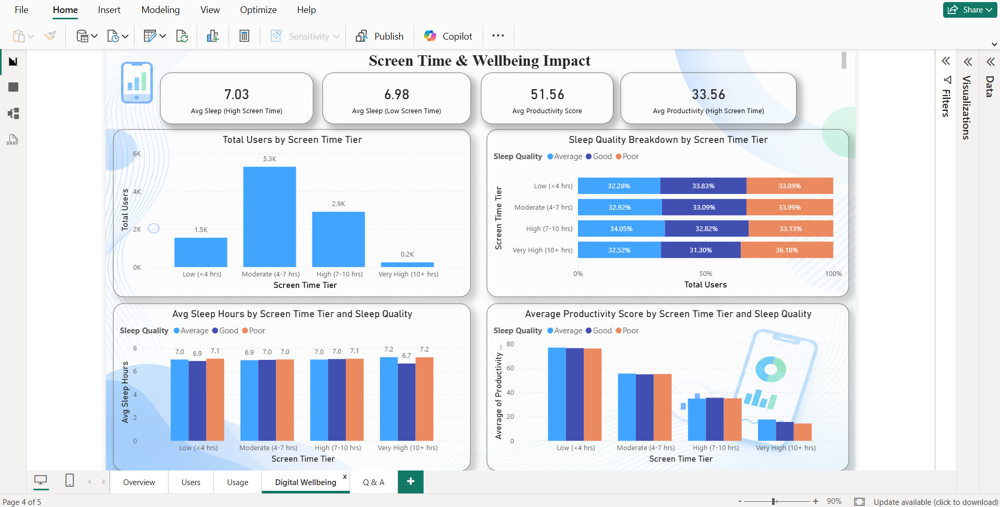
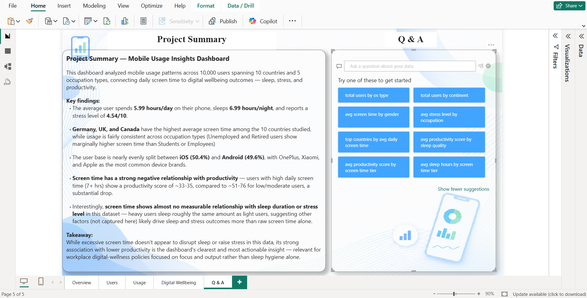

# 📱 Mobile Usage Insights Dashboard

An interactive Power BI dashboard designed to analyze mobile usage patterns, user behavior, and digital wellbeing insights using a mobile device usage dataset.

---

## 📌 Project Overview

The **Mobile Usage Insights Dashboard** is a data analytics project developed using Microsoft Power BI.

The dashboard analyzes mobile usage behavior across different users and provides insights into areas such as screen time, app usage, data consumption, user behavior, and digital wellbeing.

The project demonstrates the complete process of transforming raw data into meaningful and interactive business insights using data cleaning, data modelling, DAX, and Power BI visualizations.

---

## 🎯 Project Objectives

The main objectives of this project are:

- Analyze mobile usage patterns across users.
- Understand screen time and application usage behavior.
- Identify trends in mobile and data consumption.
- Analyze user behavior and digital wellbeing indicators.
- Create an interactive dashboard for exploring the data.
- Present complex data in a clear and easy-to-understand format.

---

## 🛠️ Technologies & Tools Used

- **Microsoft Power BI**
- **Power Query** – Data cleaning and transformation
- **DAX** – Calculated measures and analytical calculations
- **Data Modelling**
- **Data Visualization**
- **CSV Dataset**

---

## 📊 Dashboard Pages

The dashboard consists of four main pages:

### 1. 📌 Overview

Provides a high-level summary of the mobile usage dataset through:

- Key Performance Indicators (KPIs)
- User-related metrics
- Mobile usage statistics
- Summary visualizations
- Interactive filters

### 2. 👥 Users

Focuses on user-level analysis, including:

- User demographics
- User behavior patterns
- Usage-related metrics
- Comparison between different user groups

### 3. 📱 Usage

Analyzes mobile usage behavior, including:

- Screen time
- App usage
- Mobile usage patterns
- Data consumption
- Usage comparisons

### 4. 🧘 Wellbeing

Provides insights related to digital wellbeing, including:

- Screen-time behavior
- Usage patterns
- Wellbeing-related indicators
- Relationship between mobile usage and user wellbeing

---

## 🔄 Data Analytics Workflow

The project follows a structured data analytics workflow:

```text
Raw Dataset
     ↓
Data Cleaning & Transformation
     ↓
Data Modelling
     ↓
DAX Calculations
     ↓
Data Visualization
     ↓
Interactive Power BI Dashboard
     ↓
Insights & Analysis
```
---

## 📊 Dashboard Screenshots

### 🏠 Overview


### 👥 Users


### 📱 Usage


### ❤️ Digital Wellbeing


### ❓ Q&A


---
